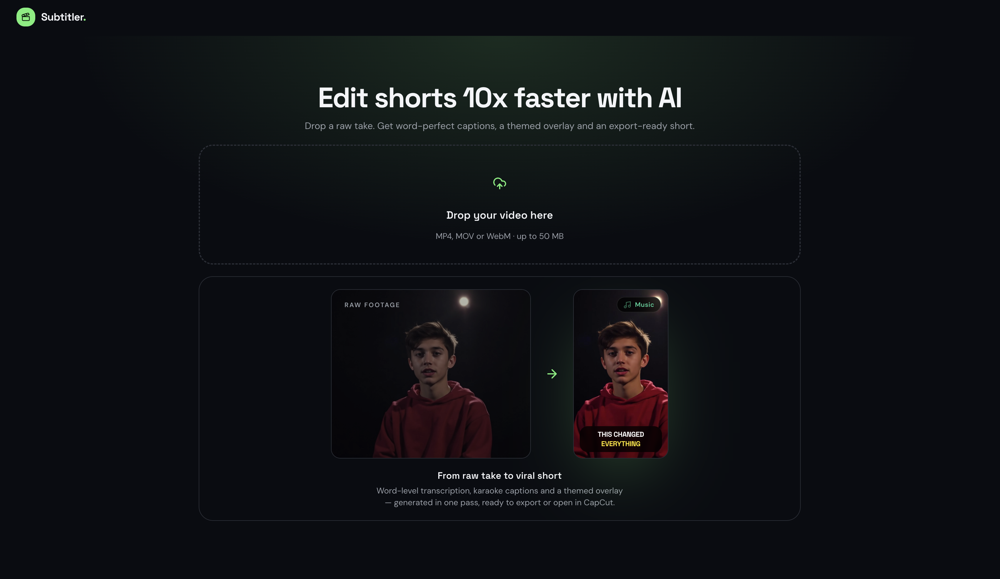
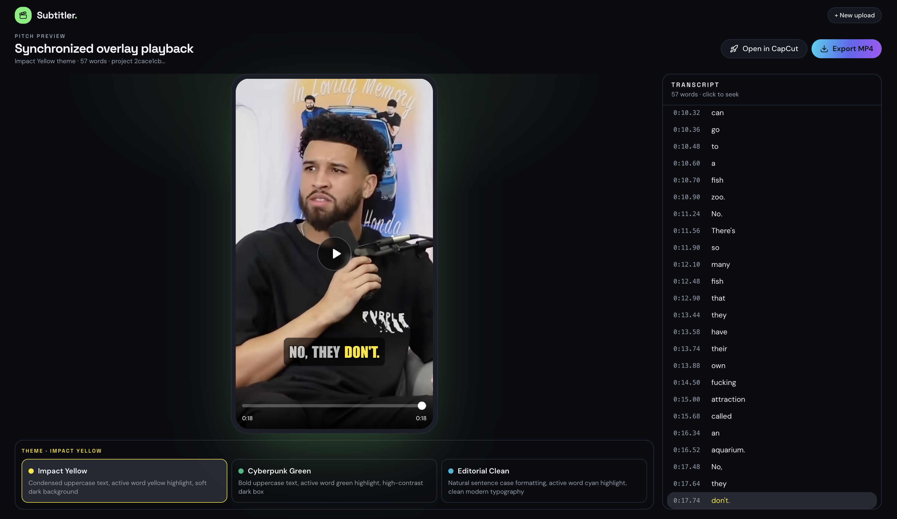

<div align="center">

# Subtitler Studio

### AI caption & Background Music studio for short-form video

[](https://nextjs.org/)
[](https://www.typescriptlang.org/)
[](https://supabase.com/)

> **Transform raw video clips into viral, dynamically subtitled shorts with AI-driven karaoke captions & auto-ducked background music in 1-click.**

[Overview](#-overview--vision) · [Demo](#-demo--screenshots) · [Features](#-key-features) · [Stack](#-technical-architecture--stack) · [Setup](#-getting-started--local-setup)
</div>

<video src="https://github.com/NassAbd/generathon/raw/main/docs/screenshots/demo_generathon.mp4" width="100%" controls></video>

---

## 📑 Table of Contents


- [Overview & Vision](#-overview--vision)
- [Demo & Screenshots](#-demo--screenshots)
- [Key Features](#-key-features)
- [Technical Architecture & Stack](#-technical-architecture--stack)
- [Documentation & Resources Used](#-documentation--resources-used)
- [Prerequisites & Requirements](#-prerequisites--requirements)
- [Getting Started & Local Setup](#-getting-started--local-setup)
- [Project Roadmap / What's Next](#-project-roadmap--whats-next)
- [Contributors & Credits](#-contributors--credits)

---

## 🌟 Overview & Vision

**Subtitler Studio** is a single-viewport web product that turns a raw talking-head clip into an export-ready vertical short — with word-synced karaoke captions, themed overlays, and balanced background music — without opening a traditional video editor.

### The Problem

Creating engaging short-form content with **word-by-word karaoke captions** and **balanced background music** still takes hours of manual editing: scrubbing timelines, styling captions, leveling music under speech, and bouncing between tools for a CapCut-ready finish.

### The Solution

A **studio** that automates the pipeline end-to-end:

1. Upload a clip → cloud transcription with word-level timestamps  
2. Apply customizable motion caption themes (`Impact Yellow`, `Cyberpunk Green`, `Editorial Clean`)  
3. Auto-assign and preview background music with mix levels aligned to export  
4. Export instantly via **client canvas MP4** or **1-click CapCut draft** injection  

---

## 🎬 Demo & Screenshots

**Demo video:** [Local MP4](docs/screenshots/demo_generathon.mp4) · [YouTube](https://youtu.be/qYTPJdWQOnw)

### Landing Page (Single Viewport Upload)



### Studio Editor & Theme Selector



---

## ✨ Key Features

- **Single Viewport Experience** — Clean, zero-scroll app-first UI inspired by VEED & Submagic.
- **Word-Level AI Transcription** — Precise timestamping and active-word synchronization in preview + export.
- **Viral Caption Themes**
  - `Impact Yellow` — Condensed uppercase, soft dark backdrop, `#FFE600` karaoke accent  
  - `Cyberpunk Green` — High-contrast neon `#10B981` active highlight  
  - `Editorial Clean` — Cyan `#06B6D4` highlight, natural sentence case  
- **Client-Side Canvas Export Engine** — Browser rendering via HTML5 Canvas + Web Audio (`AudioContext`, `GainNode`, `MediaRecorder`) — no server burn-in required for MP4.
- **Auto-Ducked Background Music Audio Engine** — Sidechain-style attenuation (FFmpeg path) / leveled Web Audio mix (client export) so music sits under dialogue.
- **CapCut Integration** — Direct local draft write for seamless post-processing.
- **Speaker-aware Reframe Hooks** — Face/speaker offset segments fed into CapCut local export for tighter vertical framing.

---

## 🛠 Technical Architecture & Stack

```text
Landing Dropzone ──upload──► Supabase (Storage + DB)
                                      │
                                      ▼ process
                             API (Whisper + LLM decorate)
                                      │
                                      ▼
                             Studio Editor (karaoke + themes)
                          ┌───────────┴───────────┐
                          ▼                       ▼
               Client Canvas MP4          CapCut Draft / Inject
               + Web Audio mix            JSON generator
```

| Layer | Choices |
|-------|---------|
| **Frontend** | Next.js 14 (App Router), React 18, TypeScript, Tailwind CSS 3.4, Lucide Icons, Framer Motion, Sonner |
| **UI Prototyping** | [Lovable](https://lovable.dev) shell → merged into `components/studio/*` |
| **Backend & Persistence** | Supabase (Auth-ready Postgres + Storage + Realtime), Next.js Route Handlers |
| **AI** | Groq Whisper (word timestamps) |
| **Media Engine** | HTML5 `<video>`, Canvas 2D, Web Audio API, MediaRecorder |
| **Server Media** | FFmpeg (`fluent-ffmpeg` + `ffmpeg-static`) for sidechain ducking / CapCut local tooling |
| **Exports** | `lib/export/clientCanvasExporter.ts` · `lib/capcut/*` draft generator |

---

## 📚 Documentation & Resources Used

These references shaped how Subtitler Studio generates CapCut-compatible drafts and fills the creative asset pipeline.

### CapCut draft reverse-engineering (core export path)

| Resource | Role in this project |
|----------|----------------------|
| [**capcut-cli**](https://github.com/renezander030/capcut-cli) | Open-source Python CLI that programmatically builds CapCut project folders. It showed that CapCut drafts are ordinary on-disk JSON + media trees (not a closed binary format), which unlocked our TypeScript port in `lib/capcut/` — timeline tracks, text materials, audio segments, and the local “Open in CapCut” inject into `CAPCUT_DRAFTS_PATH`. |
| [**CapCut draft schema gist**](https://gist.github.com/renezander030/80823f1d47081c312d2c1f9edd20dc22) | Compact map of CapCut draft fields (`draft_content.json`, materials, segments, transforms, volumes). Used as the field-level reference when implementing karaoke subtitle segments, BGM tracks, font/box styling, and speaker reframe transforms so CapCut opens our exports without corruption. |

Without these two resources, CapCut export would have remained guesswork. They provided the practical contract I reimplemented in Next.js (instead of shelling out to Python at runtime) for reliable, 1-click draft generation.

### Creative asset references

| Resource | Role in this project |
|----------|----------------------|
| [Pixabay](https://pixabay.com/) | Royalty-free stock photos, videos, and music used for marketing frames, BGM inspiration, and demo assets. |
| [Mixkit Free Sound Effects](https://mixkit.co/free-sound-effects/) | SFX palette inspiration for whoosh / impact cues paired with caption hits. |

### Platform & web media docs

- [Next.js Documentation](https://nextjs.org/docs) — App Router, metadata, Route Handlers  
- [Web Audio API (MDN)](https://developer.mozilla.org/en-US/docs/Web/API/Web_Audio_API) — client dialog + BGM mix for MP4 export  
- [HTML5 Canvas API (MDN)](https://developer.mozilla.org/en-US/docs/Web/API/Canvas_API) — client subtitle burn-in  
- [MediaRecorder API (MDN)](https://developer.mozilla.org/en-US/docs/Web/API/MediaRecorder) — browser MP4/WebM capture  
- [Supabase Docs](https://supabase.com/docs) — Storage, Postgres, Realtime project status  
- [Sonner](https://sonner.emilkowal.ski/) — non-blocking toast UX  

---


## 📋 Prerequisites & Requirements

Before running locally, ensure you have:

| Requirement | Notes |
|-------------|--------|
| **Node.js** | v18.x or higher (v20+ recommended) |
| **Package manager** | `npm` (default), `pnpm`, or `yarn` |
| **Supabase project** | Buckets `videos` + `assets` (Background Music under `assets/bgm/`) |
| **Optional** | Local CapCut drafts folder for “Open in CapCut” |

### Environment variables

Copy [`.env.example`](./.env.example) → `.env.local`:

```env
# Public (browser-safe)
NEXT_PUBLIC_SUPABASE_URL=https://your-project-ref.supabase.co
NEXT_PUBLIC_SUPABASE_ANON_KEY=your_anon_key

# Server-only
SUPABASE_SERVICE_ROLE_KEY=your_service_role_key
GROQ_API_KEY=your_groq_api_key
OPENAI_API_KEY=your_openai_api_key
# GEMINI_API_KEY=your_gemini_api_key   # optional fallback LLM

# Optional — CapCut local inject
# CAPCUT_DRAFTS_PATH=/path/to/CapCut/User Data/Projects/com.lveditor.draft
```

---

## 🚀 Getting Started & Local Setup

### 1. Clone the repository

```bash
git clone https://github.com/NassAbd/generathon.git 
cd generathon
```

### 2. Install dependencies

```bash
npm install
```

### 3. Configure environment

Create `.env.local` at the project root (see variables above). Apply Supabase SQL from `supabase/` (e.g. `phase1.sql` and later migrations) and ensure storage buckets exist.

### 4. Run the development server

```bash
npm run dev
```

Open [http://localhost:3000](http://localhost:3000).

### 5. Typecheck & lint

```bash
npm run typecheck
npm run lint
```

### 6. Production build (optional)

```bash
npm run build
npm start
```

---

## 🔮 Project Roadmap / What's Next

- [ ] Kinetic typography animations & bouncing text effects  
- [ ] Auto-B-roll placement based on transcript keywords  
- [ ] Multi-aspect ratio support (1:1 square, 16:9 landscape)  
- [ ] Cloud-hosted demo video + polished screenshot gallery  
- [ ] Shareable public preview links with locked theme/BGM  

---

## 👥 Contributors & Credits

| Role | Credit |
|------|--------|
| **Contributor** | [Abdallah Nassur](https://github.com/NassAbd) |
| **Hackathon** | Built for the very first edition of **Generathon : 24h to Build the Future of ContentAI** |

